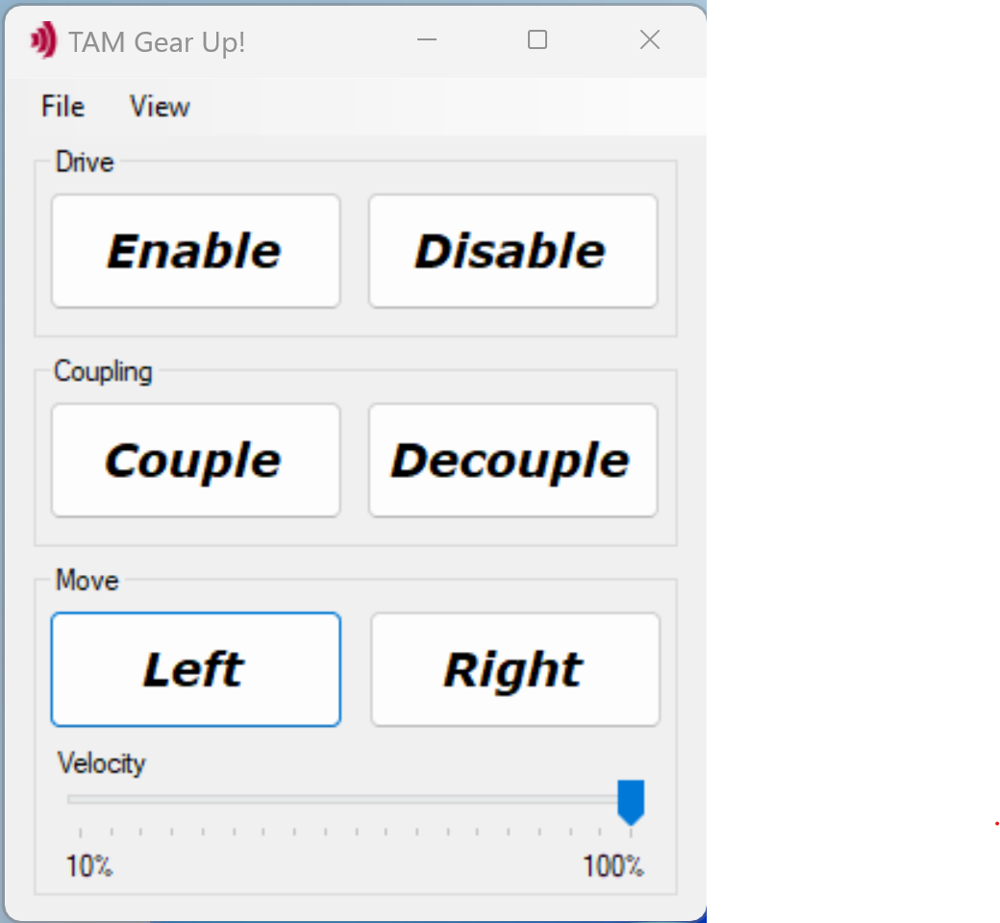

# Gear Up!

This "Gear Up!" program is a .NET windows application
demonstrating the motion of two motors coupled with an electronic gearing,
using the Triamec Advanced Motion software (TAM Software).

This program shows you
- The use of subscriptions to communicate between two drives in real-time, and
- How to write a coupling function in C#/Tama.

*Caution: you may harm your hardware when executing sample applications 
without adjusting configuration values to your hardware environment.
Please read and follow the recommendations below
before executing any sample application.*

## Hardware Prerequisites

- A *Tria-Link* PCI adapter (TL100 or TLC201)
- At least two *Triamec* drives with a motor and encoder connected and configured with a stable position controller
- A *Tria-Link* connection including the PCI adapter and the drives

## Hardware configuration adjustment

The file `GearUp.TAMcfg` must be replaced by one
appropriate for your particular hardware environment.

It is recommended to use the TAM system explorer (part of the TAM Software)
as a convenient way to create your configuration file.
With the TAM system explorer, you can:
- Boot and identify your system
- Manipulate the register values of your drives
- Save the TAM configuration as `GearUp.TAMcfg` and replace the existing default `GearUp.TAMcfg`

*The adjustment of register values is a major task 
and requires understanding of motion control.
Please contact Triamec if you need further assistance with this setup procedure.
For this "Gear Up!" program, a working TAM configuration file is a prerequisite.*

As an alternative to replacing the existing `GearUp.TAMcfg` or its content, you can 
- add your own TAM configuration file to the GearUp project,
- make sure its "Copy to Output Directory" property is set to "Copy if newer", and
- change the application setting "TamConfigurationPath" to the name of your file.

## Software Prerequisites

This project is made and built with [Microsoft Visual Studio](https://visualstudio.microsoft.com/en/).

In addition you need [TAM Software](https://www.triamec.com/en/tam-software-support.html) installation.

## Prepare and Run the *Gear Up!* Application

1. Replace the `GearUp.TAMcfg` as described above
2. In `Settings.settings`, change the Serial Number for the Slave and Master according to your Hardware. You can retrieve the Serial Numbers by clicking on the Station (red Icon) in the TAM System Explorer tree
3. Run the applicaton

## Operate the *Gear Up!* Application

- **Enable** the axes
- **Couple** the axes with the electronic gearing
- Move the axes **Left** or **Right**
- Change the Velocity via the **Slider**
- Open the built-in System Explorer on **View > TAM System Explorer** for troubleshooting and surveillance from within the application

